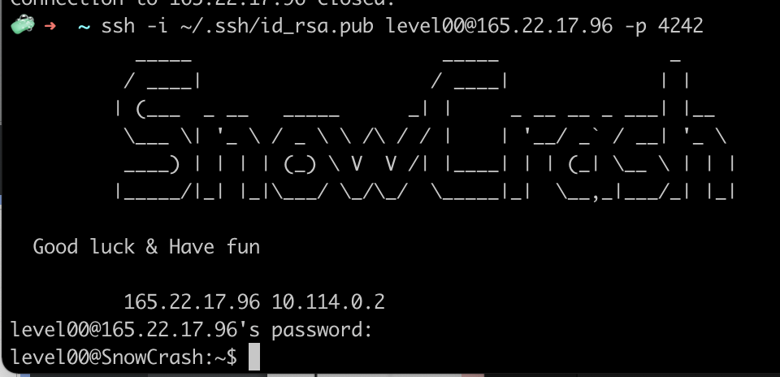
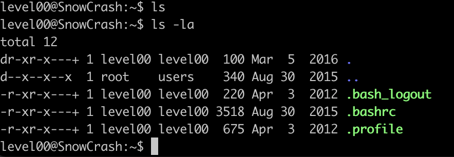
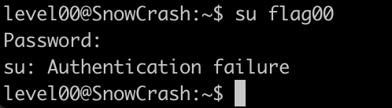
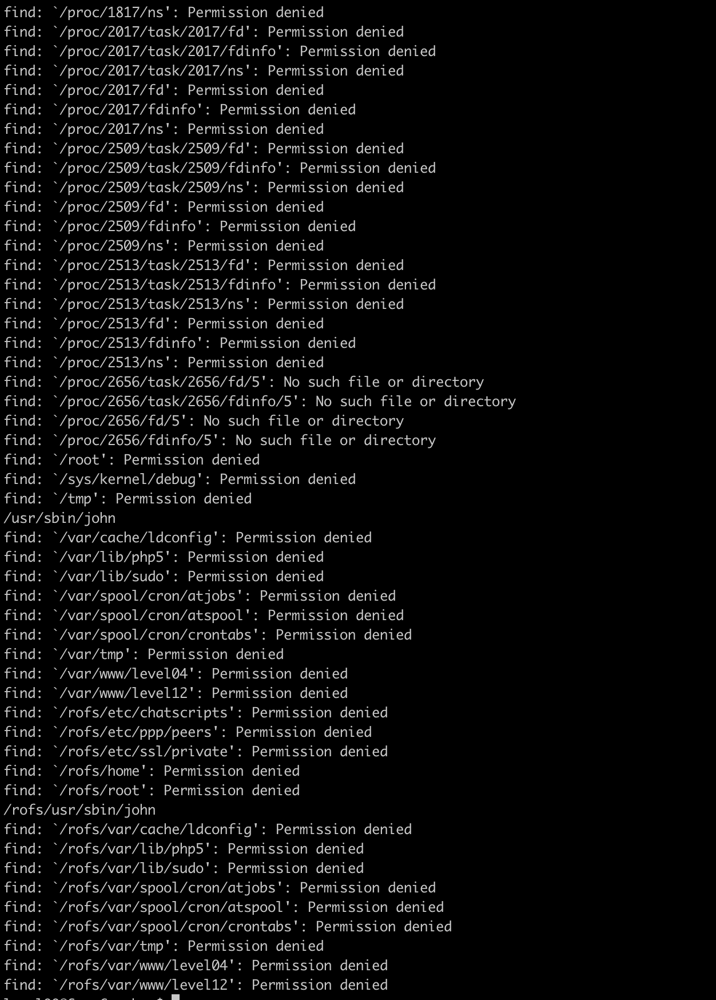
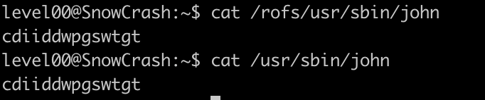

1.  First, connect to ssh with your ip address
    ssh -i ~/.ssh/id_rsa.pub level00@165.22.17.96 -p 4242
    password for level00 : level00

2.  Nothing can be found with ls.
    Result of ls -la
    

3.  Need to find the password for "su flag00"

4.  Result of wrong password.
    

5.  `Once registered, you’re gonna have to find the password that will log you in with
the "flagXX" account. 
So, need to find the account who use flag00` (written in the subject ).
    So, try to put the command as below to find the flag00 in the file type
    `find / -type f -user flag00`

         There are only 2 file paths which doesn't show "Permission denied"

    They possess the same password as cdiiddwpgswtgt

=> But it was NOT the correct password. We can possibly think, maybe this password is encyrpted? in this case, we need to decrypt them.
