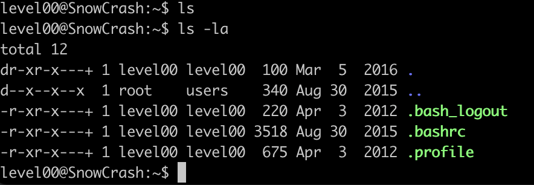

LEVEL00
=======
1.  First, connect to ssh with your ip address :
```
    ssh -i ~/.ssh/id_rsa.pub level00@165.22.17.96 -p 4242

    level00@165.22.17.96's password:
        
    level00@SnowCrash:~$ ls
    level00@SnowCrash:~$ ls -la
    total 12
    dr-xr-x---+ 1 level00 level00 100 Mar 5 2016 .
    d--x--x--x 1 root users 340 Aug 30 2015 ..
    -r-xr-x---+ 1 level00 level00 220 Apr 3 2012 .bash_logout
    -r-xr-x---+ 1 level00 level00 3518 Aug 30 2015 .bashrc
    -r-xr-x---+ 1 level00 level00 675 Apr 3 2012 .profile
 ```       
2.  Nothing can be found with ls.
    Result of ls -la

    

3.  Need to find the password for "su flag00"

4.  Result of wrong password.
 
    

5.  Once registered, you’re gonna have to find the password that will log you in with
the "flagXX" account. So, we need to find the account who use flag00 (written in the subject). So, try to put the command as below to find the flag00 in the file type.

`find / -type f -user flag00`

```
    1) find / : Starts the search from the root directory. This search will include all directories and subdirecotires

    2)  -user flag00 : Specifices the search criterion. It looks for files owned by the user with the username "flag00"
    
    3) -exec ls -l {} \;: Executes the ls -l command on each file found. The {} is a placeholder for the current file, and \; signifies the end of the -exec command.

    4)2>/dev/null: Redirects standard error (file descriptor 2) to /dev/null, effectively discarding error messages. This is done to suppress error messages related to inaccessible directories or files due to permission issues.
```                                                                                     

There are only 2 file paths which doesn't show "Permission denied"


They possess the same password as cdiiddwpgswtgt


=> But it was NOT the correct password. We can possibly think, maybe this password is encyrpted? in this case, we need to decrypt them.

ROT 13?

- Letter substitution cipher
- ROT are short for Rotate
- Each letter in alphabet has a numeric position(1-26)
- A = position 1
- B = position 2
- Z = position 26 (last position)
- Rotate : Replaces each word with the 13th letter after it
- After position(p) greater than 26, letters reset to p-26

ROT13 Reverse Translation

- Alphabet position -13
  - if this value is negative, then substract the absolute value of it from 26
- This is the new position

REF : <https://www.dcode.fr/chiffre-rot>


</img><br/>

So I tried to use the first decrypted result (ROT 15), so that's how we got the result!


