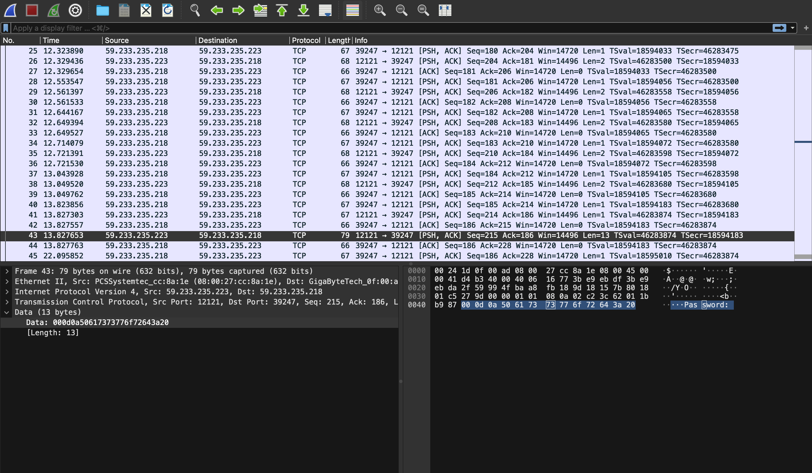
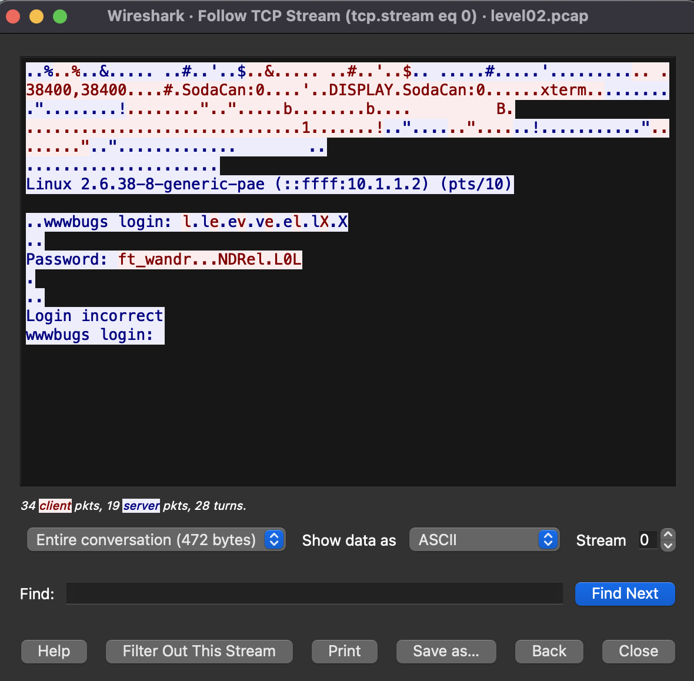

# LEVEL02

1. Login to the level02

```
ssh -i ~/.ssh/id_rsa.pub level02@127/0.0.1 -p 4242
```

2. The password of level02 is the token from level01

```
    f2av5il02puano7naaf6adaaf
```

3. With ls -la command, we found the pcap file. With a simple _cat_ command, we can see that we need a tool to open it.

```
level02.pcap
```

A .pcap (short for Packet Capture) file is a binary file format used to store network packet data captured during network traffic monitoring or analysis. These files can be created by various packet sniffing tools and network monitoring software. The format is widely supported, making it a standard way to store and exchange captured network data.

```
dr-x------ 1 level02 level02  120 Mar  5  2016 .
d--x--x--x 1 root    users    340 Aug 30  2015 ..
-r-x------ 1 level02 level02  220 Apr  3  2012 .bash_logout
-r-x------ 1 level02 level02 3518 Aug 30  2015 .bashrc
----r--r-- 1 flag02  level02 8302 Aug 30  2015 level02.pcap
-r-x------ 1 level02 level02  675 Apr  3  2012 .profile
```

We will safely copy level02.pcap file in another local terminal and we will open with a tool "WireShark"

```
scp -P 4242 level02@127.0.0.1:/home/user/level02/level02.pcap /tmp
```

Go look for _/tmp_ in terminal and we successfully downloaded the pcap file.

```
level02.pcap      100% 8302     8.1KB/s   00:00
```

Open the pcap file with WireShark.
We found the clue of the password



To know more details of TCP Packets, clicked the "Follow TCP Stream" dialog box. The stream content is displayed in the same sequence as it appeared on the network.

**TCP Streams are "Segmented and Shipped by IP Packets".**

TCP sends its data in little chunks called IP packets (or IP datagrams). In this way, HTTP is the top layer in a "protocol stack” of “HTTP over TCP over IP,”



we can see the clue of the password as

```
Password: ft_wandr...NDRel.L0L
```
