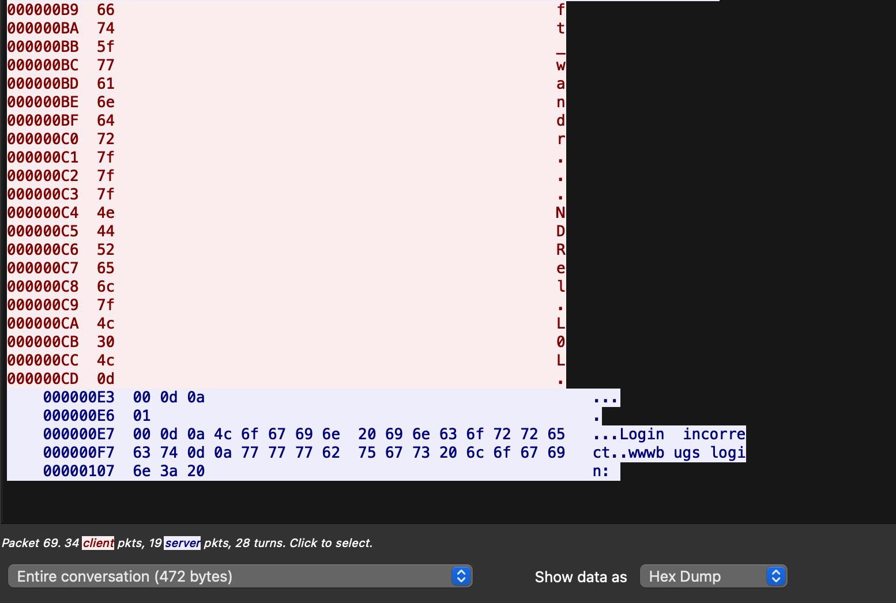

# LEVEL02

### 1. Login to the level02

```
ssh -i ~/.ssh/id_rsa.pub level02@127/0.0.1 -p 4242
```

### 2. The password of level02 is the token from level01

```
    f2av5il02puano7naaf6adaaf
```

### 3. Find the files and clues

With ls -la command, we found the pcap file. With a simple _cat_ command, we can see that we need a tool to open it.

```
level02.pcap
```

A .pcap (short for Packet Capture) file is a binary file format used to store network packet data captured during network traffic monitoring or analysis. These files can be created by various packet sniffing tools and network monitoring software. The format is widely supported, making it a standard way to store and exchange captured network data.

```
dr-x------ 1 level02 level02  120 Mar  5  2016 .
d--x--x--x 1 root    users    340 Aug 30  2015 ..
-r-x------ 1 level02 level02  220 Apr  3  2012 .bash_logout
-r-x------ 1 level02 level02 3518 Aug 30  2015 .bashrc
----r--r-- 1 flag02  level02 8302 Aug 30  2015 level02.pcap
-r-x------ 1 level02 level02  675 Apr  3  2012 .profile
```

We will safely copy level02.pcap file in another new local terminal and we will open with a tool "WireShark"

```
scp -P 4242 level02@127.0.0.1:/home/user/level02/level02.pcap /tmp
```

Go look for _/tmp_ in terminal and we successfully downloaded the pcap file.

```
level02.pcap      100% 8302     8.1KB/s   00:00
```

Go look for _/tmp_ in terminal and give the permission to the file with chmod.

Open the pcap file with WireShark.
We found the clue of the password


To know more details of TCP Packets, clicked the "Follow TCP Stream" dialog box. The stream content is displayed in the same sequence as it appeared on the network.

**TCP Streams are "Segmented and Shipped by IP Packets".**

TCP sends its data in little chunks called IP packets (or IP datagrams). In this way, HTTP is the top layer in a "protocol stack” of “HTTP over TCP over IP,”


we can see the clue of the password as below. But this is still NOT the correct password.

```
Password: ft_wandr...NDRel.L0L
```

In this case, let's change diplay to "hexdump"
And let's see if they're correctly corresponded to the HEX number and see if they're printable.



| HEX  | 66  | 74  | 5f  | 77  | 61  | 6e  | 64  | 72  |  7f   |  7f   |  7f   | 4e  | 44  | 52  | 65  | 6c  |  7f   | 4c  | 30  | 4c  |        0d         |
| :--: | :-: | :-: | :-: | :-: | :-: | :-: | :-: | :-: | :---: | :---: | :---: | :-: | :-: | :-: | :-: | :-: | :---: | :-: | :-: | :-: | :---------------: |
| CHAR |  f  |  t  | \_  |  w  |  a  |  n  |  d  |  r  | [DEL] | [DEL] | [DEL] |  N  |  D  |  R  |  e  |  l  | [DEL] |  L  |  0  |  L  | [CARRIAGE RETURN] |

- HEX 7f corresponded to DEL : So, **n, d, r** will be deleted and same for **l**.
- HEX 0d corresponded to CARRIAGE_RETURN ('\r') : so it represent the end of the line.

So, password should be from `ft_wandr...NDRel.L0L` to `ft_waNDReL0L`

So, we found our password! Let's put our password into **flag02**

```
ft_waNDReL0L
```

```
level02@SnowCrash:~$ su flag02
Password:
Don't forget to launch getflag !
flag02@SnowCrash:~$ getflag
Check flag.Here is your token : kooda2puivaav1idi4f57q8iq
flag02@SnowCrash:~$
```

### 4. Password for level03

```
kooda2puivaav1idi4f57q8iq
```
